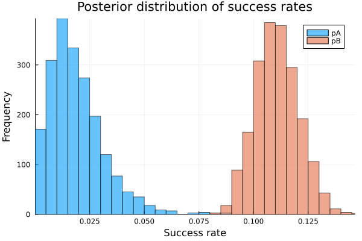

# Comparison AB test on Julia

p-value is 0.24, but the Bayesian posterior difference which A > B is 0.78.

So, in some cases, the Bayesian AB test is more reliable than the frequentist AB test...? Not sure.

- You should look at the X post : [黒木玄 Gen Kuroki on X: "#Julia言語 #統計 コメント ①P値は、「違いがない」型の仮説だけではなく、「違いはaである」型の仮説にも定義されていてaの関数になります。 ②P値関数と平坦事前分布のベイズ統計での事後分布を適切に比較すると、数値的にほぼ同等だと分かる(グラフ1段目)。続く(必読) https://t.co/VgJaB8Cj1z https://t.co/A2QsKJJWCg" / X](https://x.com/genkuroki/status/1869270908357214335)



```
julia main.jl
```

# Set up Package

Reference: [Pkg · The Julia Language](https://docs.julialang.org/en/v1/stdlib/Pkg/)

```
julia

# Push `]` to install package

add HypothesisTests Turing Distributions CSV DataFrames MCMCChains Plots StatsPlots

# Push `backspace` to exit package mode

exit()
```

# Set up Julia

Check your Platform

```
uname -m
```

And then download the corresponding version of Julia from [Download Julia](https://julialang.org/downloads/) (since I use Ubuntu, I can use glibc version in my case)

Check sha256sum
```
sha256sum julia-1.11.2-linux-x86_64.tar.gz
```

Extract the tarball
```
tar -xvzf julia-1.11.2-linux-x86_64.tar.gz
```

Move the extracted folder to opt
```
sudo mv julia-1.11.2 /opt/
```

Create a symbolic link
```
sudo ln -s /opt/julia-1.11.2/bin/julia /usr/local/bin/julia
```

Check the installation
```
julia --version
```
